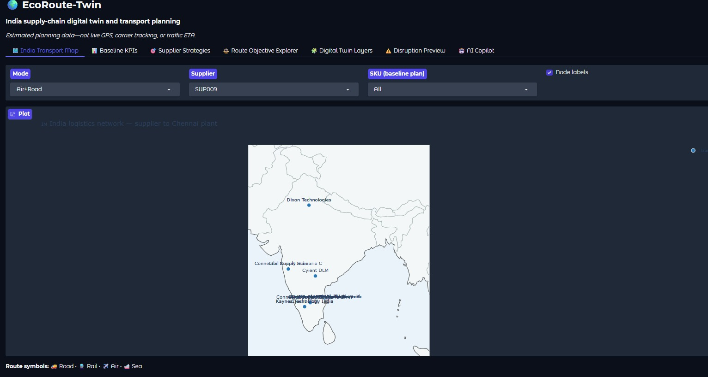
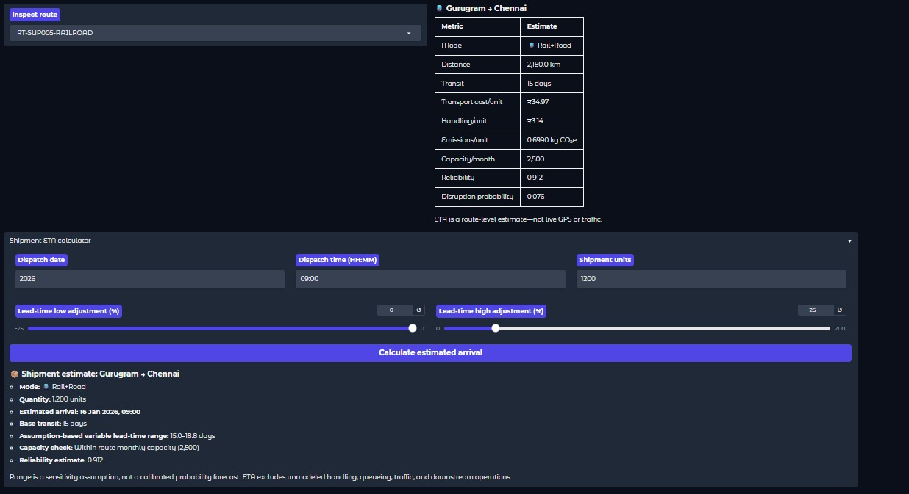
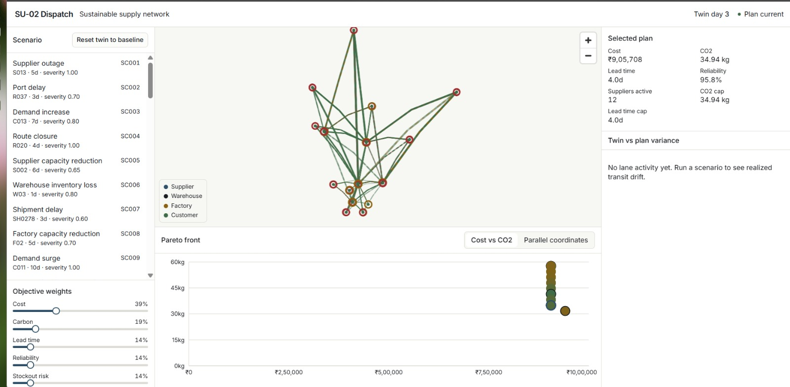
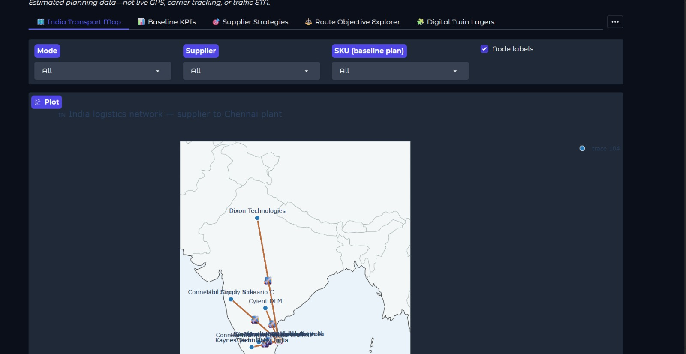

<div align="center">

# 🌿 GreenRoute-AI

### Sustainable supply-chain optimization & digital twin for Indian logistics

*Multi-objective routing · carbon accounting with full factor provenance · disruption simulation · live network map*

<br>


**Team THE THIRD EYE · t-050**

</div>

---

## 📖 Table of contents

- [The problem](#-the-problem)
- [What GreenRoute-AI does](#-what-greenroute-ai-does)
- [Screenshots](#-screenshots)
- [Architecture](#-architecture)
- [The algorithms — and why each one](#-the-algorithms--and-why-each-one)
- [Quick start](#-quick-start)
- [API reference](#-api-reference)
- [Carbon methodology](#-carbon-methodology)
- [Datasets](#-datasets)
- [Testing](#-testing)
- [Known limitations](#-known-limitations)
- [Troubleshooting](#-troubleshooting)

---

## 🎯 The problem

Indian logistics runs on a trade-off nobody makes explicitly. A planner picks the
cheapest lane, and the carbon cost is invisible. Someone mandates a green target,
and the delivery slips without anyone knowing by how much. When a supplier goes
down in Chennai, finding the recovery plan takes days of spreadsheet work.

Three things are usually missing:

1. **Cost, carbon and service are optimized separately** — so improving one
   silently damages another.
2. **Carbon numbers have no provenance.** A dashboard shows "1,240 kg CO₂e" and
   nobody can say which factor produced it or whether it was measured or guessed.
3. **Disruption response is manual.** There's no way to ask *what if* and get a
   feasible answer.

GreenRoute-AI addresses all three, over a real multi-echelon network of
**15 suppliers, 4 factories, 5 warehouses, 24 customers and 389 transport lanes**
spanning road, rail and air.

---

## ✨ What GreenRoute-AI does

| Capability | How |
|---|---|
| 🎯 **Multi-objective optimization** | NSGA-II generates a true Pareto front across cost, CO₂e, lead time and reliability. You choose the point; the trade-off is always visible. |
| 🚚 **Vehicle routing** | OR-Tools CVRPTW with capacity, time windows and driver-hour limits. Per-leg CO₂ computed from *actual cumulative load*, not an average. |
| 🌍 **Carbon accounting** | Every emission factor carries a `Source` and a `Data_Status` — published, modeled, or user-configured. Nothing is a bare number. |
| 📦 **Inventory risk** | Monte Carlo over 1,000 seeded trials per node-product. Returns P(stockout) and CVaR-90, never a point estimate. |
| ⚡ **Disruption simulation** | 54 scenarios — supplier outage, route closure, demand surge, fuel spike, monsoon disruption. The twin re-runs and re-optimizes. |
| 🗺️ **Live network map** | MapLibre GL, India-centred, with mode-coded lanes and state-coloured nodes. |
| 🔮 **Delay prediction** | Gradient-boosted classifier over a 3-class delay target, returning a full probability distribution. |
| 📈 **Demand forecasting** | ETS with bootstrapped residuals → P10/P50/P90 bands, validated by walk-forward backtest. |

---

## 📸 Screenshots

> **Note:** adjust the captions below so they match the order of your images.

<div align="center">

### Network console — the operational view



*The India-centred MapLibre network: suppliers, factories, warehouses and customers,
with lanes coloured by transport mode and nodes coloured by inventory cover.
Under 2 days of cover is critical, under 5 is a warning — thresholds documented,
not invented.*

<br>

### Pareto front — the trade-off, made explicit



*Every dot is a feasible plan produced by NSGA-II. Selecting one shows exactly what
the greener option costs in money and days. There is no single "best" plan, and the
interface refuses to pretend otherwise.*

<br>

### Shipment quoting — cost, carbon and service side by side



*Chargeable weight, feasible modes, and per-mode cost / CO₂e / transit time /
on-time probability. Infeasible modes show the reason they were ruled out, not just
a grey badge.*

<br>

### Digital twin & disruption simulation



*Applying a scenario re-runs the twin tick by tick, surfaces shortages, and triggers
re-optimization. Simulated outcomes are labelled as simulated throughout.*

</div>

---

## 🏗️ Architecture

```
┌─────────────────────────────────────────────────────────────────┐
│  FRONTEND — Next.js 14 App Router · TypeScript · Tailwind       │
│                                                                  │
│   /              Network console — map, Pareto, scenarios       │
│   /quote         Shipment quoting                               │
│                                                                  │
│   src/lib/api.ts    ← the ONLY module that calls fetch          │
│   src/lib/types.ts  ← mirrors backend Pydantic schemas          │
└────────────────────────────┬────────────────────────────────────┘
                             │  HTTP / JSON
┌────────────────────────────▼────────────────────────────────────┐
│  BACKEND — FastAPI                                               │
│                                                                  │
│   api.py               all HTTP endpoints                       │
│   optimizer.py         PuLP / CBC min-cost LP with ε-constraints│
│   optimizer_nsga.py    pymoo NSGA-II multi-objective front      │
│   pareto_cache.py      warms + caches 55 fronts in background   │
│   routing.py           OR-Tools CVRPTW, exact per-leg CO₂       │
│   modes.py             quoting, chargeable weight, feasibility  │
│   twin.py              tick loop, scenarios, re-opt triggers    │
│   risk.py              Monte Carlo stockout risk (CVaR-90)      │
│   eta.py               GradientBoostingClassifier delay model   │
│   forecast.py          ETS + bootstrapped residual bands        │
│   reliability.py       Beta-Binomial supplier posteriors        │
│   network.py           NetworkX graph construction              │
│   data_loader.py       the ONLY module that reads CSVs          │
└────────────────────────────┬────────────────────────────────────┘
                             │
┌────────────────────────────▼────────────────────────────────────┐
│  DATA — 20 CSVs + data/original/ pre-augmentation snapshots     │
└──────────────────────────────────────────────────────────────────┘
```

**Two invariants worth knowing before you contribute:**

- `data_loader.py` is the single point of contact with the filesystem. Nothing else
  calls `pd.read_csv`. New tables go into the `Dataset` dataclass.
- `src/lib/api.ts` is the single point of contact with the backend. Components never
  `fetch` directly.

---

## 🧠 The algorithms — and why each one

This is the part we'd most like you to read. Every choice below was made
deliberately, and we can defend each one with the data.

| Problem | Method | Why this and not something flashier |
|---|---|---|
| **Multi-objective planning** | NSGA-II (pymoo), SBX crossover, polynomial mutation, pop 120 × 300 gen | Cost / CO₂ / time / reliability genuinely conflict. A weighted sum hides that; a Pareto front exposes it. |
| **Plan selection under caps** | PuLP → CBC, branch-and-bound + ε-constraint sweep | Exact and deterministic. Reports infeasibility honestly instead of returning a degraded plan. |
| **Vehicle routing** | OR-Tools CVRPTW, `PATH_CHEAPEST_ARC` → Guided Local Search | Capacity + time windows + driver hours is NP-hard. GLS gets a strong solution inside a 5-second budget. |
| **Delay prediction** | `GradientBoostingClassifier`, 3-class target {0,1,2} days | Real machine learning, and the right kind: it returns `predict_proba`, so the UI shows "71% on time, P90 Thursday" rather than a fake-precise single date. |
| **Demand forecasting** | ETS (simple exponential smoothing) + bootstrapped residuals | **We deliberately did not use an LSTM.** Demand is 90 days × 24 series at CV 0.176 with no trend. A neural network on that overfits and can't be defended. ETS is correct here, and the walk-forward backtest with pinball loss proves it. |
| **Supplier reliability** | Beta-Binomial Bayesian shrinkage | Some suppliers have 26 observations, some 78. A raw rate over-trusts small samples; the posterior shrinks them toward the declared prior by exactly the right amount. |
| **Stockout risk** | Monte Carlo, 1,000 seeded trials → P(stockout) + CVaR-90 | Gives the full loss distribution, including the tail. Quantile regression would give the quantiles but not the tail expectation. |
| **Emissions** | Physics: `EF × distance × load-interpolation` | **We deliberately did not fit a regression.** Our CO₂ values derive from published factors, so training a model on them would relearn the formula with added error — and destroy the audit trail that makes the numbers trustworthy. |

> **On the word "AI":** the honest breakdown is that delay prediction is real
> supervised ML, forecasting is classical statistics, stockout risk is simulation,
> optimization is operations research, and emissions are arithmetic. We use the
> right tool per problem rather than one model everywhere. `SEED = 42` throughout,
> so every run is bit-reproducible.

---

## 🚀 Quick start

### Prerequisites

| | Version |
|---|---|
| Python | 3.11 or 3.12 (**not** 3.13 — OR-Tools wheels lag) |
| Node.js | 18+ |

### Backend

```bash
cd backend
python -m venv .venv
source .venv/bin/activate          # Windows: .venv\Scripts\activate
pip install -e ".[dev]"
uvicorn dispatch.api:app --reload --port 8000
```

API docs: **http://localhost:8000/docs**

### Frontend

```bash
cd frontend
cp .env.example .env.local
npm install
npm run dev
```

App: **http://localhost:3000**

### Environment variables

| Variable | Where | Required | Purpose |
|---|---|---|---|
| `NEXT_PUBLIC_API_URL` | `frontend/.env.local` | ✅ | Backend base URL |
| `NEXT_PUBLIC_MAP_STYLE_URL` | `frontend/.env.local` | ❌ | MapLibre basemap (MapTiler / Carto / Stadia). Unset → built-in flat canvas, no tile server needed |
| `GEMINI_API_KEY` | `backend/.env` | ❌ | AI explanations. **The platform works fully without it** |

> ⚠️ `NEXT_PUBLIC_*` variables are inlined at **build** time. Change one and you must
> restart `npm run dev`, or the old value stays compiled into the bundle.

---

## 🔌 API reference

| Method | Endpoint | Returns |
|---|---|---|
| `GET` | `/health` | Liveness + solver-cache warm progress |
| `GET` | `/network/nodes` | 48 nodes with coordinates |
| `GET` | `/network/routes` | 389 lanes with cost, CO₂, reliability |
| `GET` | `/scenarios` | Disruption scenario catalogue |
| `GET` | `/pareto` | Cached Pareto front for a scenario |
| `POST` | `/optimize` | Weighted selection, or ε-constraint solve under CO₂ / lead-time caps |
| `GET` | `/twin/state` | Current twin state: tick, in-transit, inventory |
| `POST` | `/twin/event` | Apply a scenario and advance N ticks |
| `POST` | `/twin/advance` | Advance N ticks with no scenario |
| `GET` | `/twin/variance` | Planned vs realized transit per lane |
| `POST` | `/twin/reset` | Restore the baseline |
| `GET` | `/routes/vrp` | CVRPTW solution for a depot |
| `GET` | `/fleet/utilisation` | Per-vehicle utilisation |
| `POST` | `/shipment/quote` | Multi-mode shipment quote |

---

## 🌍 Carbon methodology

**Lane level** — emissions come from `CO2_per_ton_km` in
`transportation_routes_augmented.csv`, multiplied by tonnes moved and lane distance.

**Vehicle level** — load-interpolated between the empty and full factors in
`vehicles.csv`:

```
load_factor = clamp(payload_kg / payload_capacity_kg, 0, 1)
EF_load     = EF_empty + (EF_full − EF_empty) × load_factor
total_kg    = EF_load × distance_km
```

This is the **identical** arithmetic `routing.py` uses for per-leg CO₂, so no two
surfaces in the app can disagree about the same trip.

### Three rules we hold to

1. **CO₂ is computed from gross physical mass, never chargeable weight.** Chargeable
   weight (`max(gross, volume ÷ divisor)`) is a *billing* construct. Using it for
   emissions would overstate CO₂ for light bulky freight.
2. **Every factor states its status** — `VERIFIED_PUBLISHED`, `MODELED_ESTIMATE`, or
   `USER_CONFIGURED` — and the UI shows it.
3. **Offsets are never netted against reductions.** Compensation is compensation.

---

## 📊 Datasets

| File | Rows | Contents |
|---|---|---|
| `node_coordinates.csv` | 48 | 15 Supplier · 4 Factory · 5 Warehouse · 24 Customer |
| `transportation_routes_augmented.csv` | 389 | Truck_Diesel, Truck_Electric, Rail, Air |
| `vehicles.csv` | 12 | 8 classes with empty/full emission factors |
| `inventory_augmented.csv` | 4,050 | Daily positions with cover and risk band |
| `demand.csv` | 2,160 | 90 days × 24 customer-product series |
| `shipments_augmented.csv` | 600 | Historical shipments, 61.8% on time |
| `parcels.csv` | 400 | Booked parcels with ready/deadline windows |
| `corridor_speeds.csv` | 169 | Urban/highway split, tolls, road quality |
| `scenarios_augmented.csv` | 54 | Outages, closures, surges, fuel spikes |

Generation methodology is in `data/README_AUGMENTED.md`; validation output in
`data/VALIDATION_REPORT.txt`. Pre-augmentation snapshots are preserved in
`data/original/`.

---

## 🧪 Testing

```bash
cd backend && pytest -q
cd frontend && npm run lint && npm run build
```

Coverage spans dataset schema validation, optimizer constraints, capacity
feasibility, scenario isolation, twin reconciliation, predictive-model calibration,
and every API endpoint.

---

## ⚠️ Known limitations

We would rather state these than have you find them.

- **Synthetic and modeled data.** Costs, capacities, reliabilities and emission
  factors are scenario estimates, not verified carrier or supplier figures.
- **No live telemetry.** No GPS, no traffic feed, no carrier tracking. Any vehicle
  position shown is interpolated from modeled transit times.
- **No per-model emission factors.** Factors are by vehicle class, not by make and
  model.
- **City-level coordinates.** Node positions approximate facilities; they are not
  surveyed locations.
- **Optimality is scoped.** The LP reports solver status honestly; the NSGA-II front
  is a heuristic approximation of the Pareto set, not a proven global front.
- **Tank-to-wheel only.** Upstream fuel production, empty repositioning legs and
  terminal handling are excluded.
- **First boot is slow.** 55 Pareto fronts are solved at startup. They now warm on a
  background thread, so the API answers immediately and `/health` reports progress.

---

## 🔧 Troubleshooting

**The app loads but shows no data.**

1. Check the backend is up: `curl http://localhost:8000/health`
2. If `ready: false`, the solver caches are still warming. The app works meanwhile —
   uncached scenarios just solve on demand.
3. Confirm `NEXT_PUBLIC_API_URL` matches your backend port, then **restart
   `npm run dev`** — that variable is compiled in at build time.
4. `frontend/.env.local` is gitignored, so it's absent after a fresh clone.
   `cp .env.example .env.local` fixes it.

**`pip install` fails on OR-Tools.** You're probably on Python 3.13. Use 3.11 or 3.12.

---

<div align="center">

**Team THE THIRD EYE · t-050**

*Built with the conviction that a supply-chain tool should show you the trade-off,
not hide it.*

</div>
